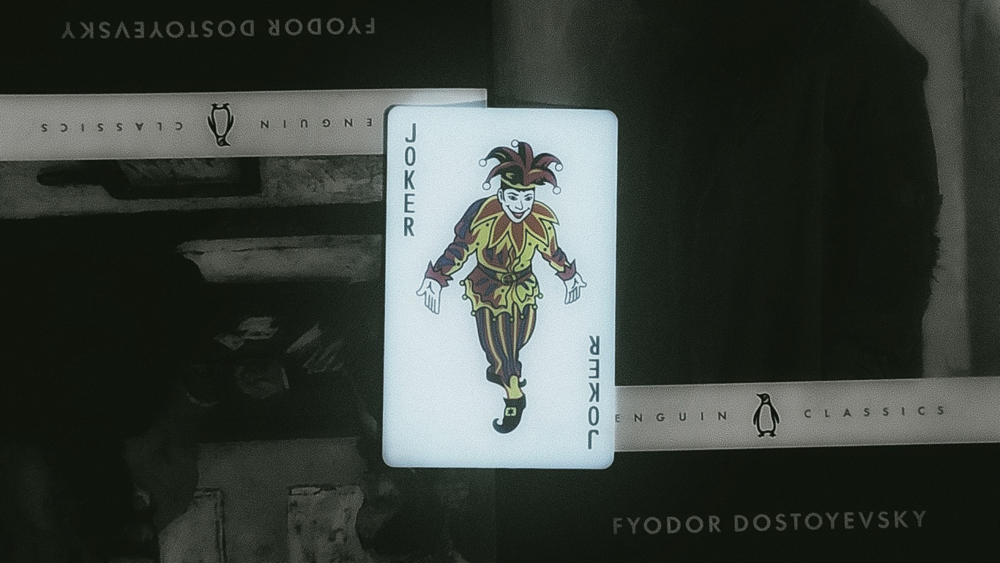

<html lang="en">
<head>
<meta charset="UTF-8">
<meta name="viewport" content="width=device-width, initial-scale=1.0">
<title>CheefLofter // operator log</title>
<link rel="preconnect" href="https://fonts.googleapis.com">
<link rel="preconnect" href="https://fonts.gstatic.com" crossorigin>
<link href="https://fonts.googleapis.com/css2?family=JetBrains+Mono:wght@400;500;700;800&family=Inter:wght@400;500;600&display=swap" rel="stylesheet">

</head>
<body>

  

    
root@cheeflofter:~$

    <nav id="siteNav">
      <a href="#about">about</a>
      <a href="#stack">stack</a>
      <a href="#cases">cases</a>
      <a href="#roadmap">roadmap</a>
      <a href="#contact">contact</a>
    </nav>
    <button class="nav-toggle" id="navToggle" aria-expanded="false" aria-controls="siteNav" aria-label="Toggle navigation">
      
    </button>
  

  

    
    

  

  

    

      
      

        
~/cheeflofter

        STATUS: ACTIVE // LEVEL 0
      

      
student — cyber security — web dev

      

        Cyber student who likes breaking things and then figuring out how to stop people like me. Spend my time between CTFs, home lab chaos, and learning both sides of the fence — offencive and defensive .
      

      

        <a class="btn primary" href="#roadmap">view roadmap</a>
        <a class="btn" href="https://github.com/CheefLofter" target="_blank" rel="noopener">github ↗</a>
        <a class="btn" href="#contact">get in touch</a>
      

    

  

  <section id="about">
    
profile

    <h2>about this operator</h2>
    

      
designationCheefLofter

      
trackStudent — transitioning from web development into cyber security

      
focusapp securitysecure toolingdefensive fundamentals

      
approachLearning by building — shipping small real tools first, layering in security-specific practice as the fundamentals solidify.

    

  </section>

  <section id="stack">
    
loaded modules

    <h2>tech stack</h2>
    
The languages and frameworks currently in active use across projects.

    

      
Pythonscripting / tooling

      
Gobackend services

      
FlaskPython web apps

      
Next.jsfrontend framework

      
HTML5markup

      
CSS3styling

      
NPMpackage tooling

    

  </section>

  <section id="cases">
    
shipped work

    <h2>case files</h2>
    
Projects built so far — the foundation the security track is being layered onto.

    

      
CASE01

      

        <h3>FileFlow</h3>
        
A zero-knowledge file sharing tool built to share files securely — the closest existing project to a security-first design goal: the server shouldn't be able to read what it's storing.

        
zero-knowledgesecure sharingHTML

        <a class="repo-link" href="https://github.com/CheefLofter/FileFlow" target="_blank" rel="noopener">github.com/CheefLofter/FileFlow ↗</a>
      

    

    

      
CASE02

      

        <h3>Staky-ai</h3>
        
An audio-to-notes tool that converts spoken input into structured written notes.

        
JavaScriptaudio processing

        <a class="repo-link" href="https://github.com/CheefLofter/Staky-ai" target="_blank" rel="noopener">github.com/CheefLofter/Staky-ai ↗</a>
      

    

    

      
CASE03

      

        <h3>better-posts</h3>
        
A JavaScript project exploring improvements to how posts are created and displayed.

        
JavaScript

        <a class="repo-link" href="https://github.com/CheefLofter/better-posts" target="_blank" rel="noopener">github.com/CheefLofter/better-posts ↗</a>
      

    

  </section>

  

  <section id="contact">
    
open channels

    <h2>get in touch</h2>
    

      <a class="contact-card" href="https://github.com/CheefLofter" target="_blank" rel="noopener">
        
GitHub

        
@CheefLofter

      </a>
      <a class="contact-card" href="https://discord.gg/cheeflofter" target="_blank" rel="noopener">
        
Discord

        
cheeflofter

      </a>
    

  </section>

<footer>
  built with intent // last sync: 2026
</footer>

</body>
</html>
